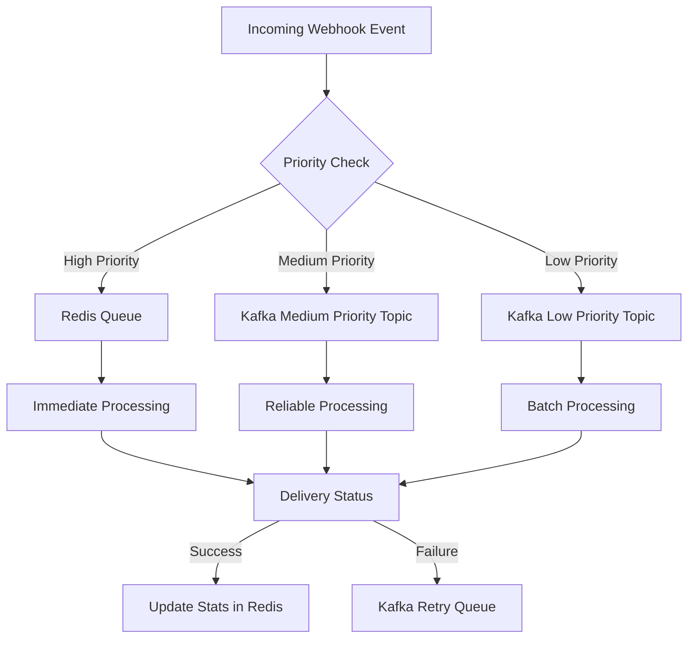

# Webhook System Architecture

## Role Distribution in Webhook System

### 1. Redis Roles

#### A. Rate Limiting (API Gateway)

```typescript
// In api-gateway.middleware.ts
private static async checkRateLimit(key: string, config: RateLimitConfig): Promise<boolean> {
  // Uses Redis Sorted Sets (ZSET) for time-window based rate limiting
  await redisRateLimit.zremrangebyscore(key, 0, windowStart);
  const requestCount = await redisRateLimit.zcard(key);
}
```

#### B. Authentication Cache

```typescript
// In api-gateway.middleware.ts
static authenticate() {
  // Uses Redis key-value store for API key validation
  const isValid = await redisRateLimit.get(`apiKey:${apiKey}`);
}
```

#### C. Real-time Event Bus (High Priority Events)

```typescript
// In webhooks.service.ts
case 'HIGH':
  // Immediate processing using Redis List
  await redis.lpush(HIGH_PRIORITY_QUEUE, JSON.stringify(deliveryPayload));
  // Real-time pub/sub for instant notifications
  await redisPub.publish(constants.webhook.webhookQueue, JSON.stringify(deliveryPayload));
```

#### D. Real-time Stats

```typescript
// In webhooks.service.ts
private async updateRealtimeStats(subscriptionId: string, eventType: string) {
  // Uses Redis Hash for counters
  await redis.multi()
    .hincrby(key, 'total_events', 1)
    .hincrby(key, `event_type:${eventType}`, 1)
    // Uses Sorted Set for timeline
    .zadd(`${key}:timeline`, now, now.toString())
    .expire(key, 86400)
    .exec();
}
```

### 2. Kafka Roles

#### A. Event Processing (Medium/Low Priority)

```typescript
// In webhooks.service.ts
case 'MEDIUM':
  // Reliable event processing using Kafka
  await kafka_produce(constants.kafka.mediumPriorityTopic, JSON.stringify(deliveryPayload));
case 'LOW':
  // Batch processing using Kafka
  await kafka_produce(constants.kafka.lowPriorityTopic, JSON.stringify(deliveryPayload));
```

#### B. Retry Queue

```typescript
// In webhooks.initializer.ts
private async startDeliveryWorker() {
  // Process failed deliveries through Kafka for reliable retry
  await kafka_produce(constants.kafka.webhookRetry, JSON.stringify(delivery));
}
```

## System Flow



## Component Responsibilities

### 1. WebhookInitializer

- Initializes the event processing system
- Sets up Redis pub/sub for real-time events
- Configures Kafka consumers for different priority queues
- Manages the retry mechanism for failed deliveries

### 2. WebhooksService

- Handles event processing logic
- Routes events based on priority
- Manages real-time statistics
- Handles retry logic with exponential backoff

### 3. ApiGateway

- Manages rate limiting using Redis
- Handles API key authentication
- Protects webhook endpoints

## Data Flow Patterns

### 1. High Priority Events

## Performance Considerations

### Redis Usage

- Rate limiting: Uses ZSET for accurate time-window tracking
- Real-time stats: Uses Hash and ZSET for efficient counters and timelines
- High-priority queue: Uses List for FIFO processing
- Pub/Sub: For immediate event notifications

### Kafka Usage

- Medium/Low priority events: Durable message queue
- Batch processing: Efficient handling of large volumes
- Retry mechanism: Reliable delivery guarantees
- Dead letter queue: Handling of failed deliveries

## Scaling Considerations

### Redis Scaling

- Use Redis Cluster for high availability
- Consider Redis Sentinel for failover
- Implement cache eviction policies

### Kafka Scaling

- Multiple partitions for parallel processing
- Consumer groups for load distribution
- Topic replication for fault tolerance

## Monitoring and Alerts

### Redis Metrics

- Queue length
- Processing time
- Cache hit/miss ratio
- Memory usage

### Kafka Metrics

- Consumer lag
- Topic throughput
- Failed deliveries
- Retry queue size

## Error Handling

### Redis Failures

- Circuit breaker pattern
- Fallback to Kafka for persistence
- Retry mechanism for rate limiting

### Kafka Failures

- Dead letter queue
- Exponential backoff
- Alert on consumer group lag
